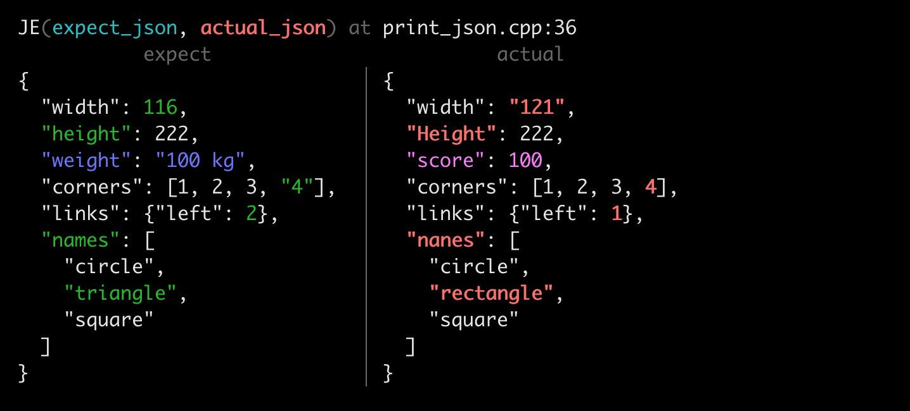

<a id="top"></a>
[](https://github.com/lingjf/h2unit/releases)
[](https://github.com/lingjf/h2unit/actions/workflows/ci.yml)
[](https://en.wikipedia.org/wiki/C%2B%2B#Standardization)
[]()
[]()
[]()
[]()
[]()
[]()
[](http://www.gnu.org/software/gcc)
[](https://releases.llvm.org/download.html)
[]()
[]()


## What's h2unit

*H2UNIT* is a [xUnit](https://en.wikipedia.org/wiki/XUnit) unit test framework for C/C++, a light-weight framework as light as chemical hydrogen.


## How to use it

* [Tutorial](doc/tutorial.md) - getting started
* [Options](doc/options.md) - executable options
* [Reference](doc/reference.md) - primitives manual
* [Frequently asked questions](doc/faq.md)

Example is a helpful manual document.

All the code of following features can be found in the [example folder](example/), [test h2unit by h2unit](test/), and it is executable, the result is visable.

## Design is Difference

### 1. Dynamic STUB
Unit test cases should be easy to maintain. Dependency breaking is the key way. 

Typically, function pointer replacement is a common solution to break dependency.

```C++
/* product code */ 
int foobar_impl(int a, char* b)
{
   ......
}
int (*foobar) (int a, char* b) = foobar_impl;
void do_call_foobar()
{
   ......
   z = foobar(x, y);
   ......
}
```

```C++
/* unit test code */
int foobar_fake(int a, char* b)
{
   ......
   return 1;
}
CASE(case name)
{
   foobar = foobar_fake;
   do_call_foobar();
   foobar = foobar_impl;
}
```

The most disadvantage of function pointer replacement is changing of product source code. <br>
Objective of Dynamic STUB is same as function pointer replacement, but it is unnecessary to change product source code. <br> 

```C++
CASE(case name)
{
   STUB(foobar, foobar_fake);
   do_call_foobar();
}
```

With help of lambda, fake_function can following with STUB.

```C++
CASE(case name)
{
   STUBS(foobar, int, (int a, char* b)) {
      OK(1, a);
      sprintf(b, "return value by argument");
      return 1;
   }
   do_call_foobar();
}
```

### 2. Dynamic MOCK

Compare to Dynamic STUB, Dynamic MOCK provide a easy way to check call times, input arguments and inject return value.

```C++
CASE(case name)
{
   MOCK(foobar, int(int a, char* b)).Once(1, "A").Return(11);
   do_call_foobar();
}
```

Expect foobar called with *a* equals *1*, *b* equals *"A"* *1 time* in this case, and make it returns *11*.

### 3. JSON Compare





### 4. Matcher

Matchers, as popularized by the [Hamcrest](https://en.wikipedia.org/wiki/Hamcrest)
framework are an alternative way to write complex expection in `OK` or `MOCK`.

### 5. Header-only Single-file 
Only need to include *1* *ONE* *一* *いち* source file: [**h2unit.h**](h2unit.h) 

**h2unit.h** contains [`main()`](source/h2_unit.cpp#L90) function, and `main()` will execute test cases.
user no need to write main() anymore.


## Supported platform
*    Linux gcc 5.5+ (regex support, SFINAE support), clang 7+, x86, x86_64, arm64(aarch64)
*    macOS 10.14+ 10.15 11.05, xcode 10.3+
*    Windows Visual Studio 2019+ 16+ MSVC 14.20+ _MSC_VER 1913+
*    Windows Cygwin, MinGW 64, ucrt64, clang64
*    Windows WSL (Debian, Ubuntu, Kali, openSUSE)

