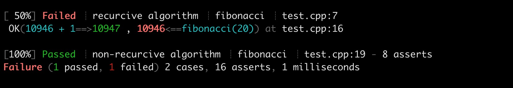

# Tutorial


```C++
// fibonacci.cpp
int fibonacci(int n) 
{
    if (n <= 1) return 1;
    return fibonacci(n - 1) + fibonacci(n - 2);
}

int fibonacci_non_recurcive(int n) {
    int current = 1;
    int previous = 1;
    for (int i = 0; i + 1 < n; ++i) {
        int temp = current;
        current = current + previous;
        previous = temp;
    }
    return current;
}

```

```C++
// fibonacci.h
int fibonacci(int n);
int fibonacci_non_recurcive(int n);
```

```C++
// test_fibonacci.cpp
#include "fibonacci.h"
#include "h2unit.h"

SUITE(fibonacci)
{
    Case(recurcive algorithm)
    {
        OK(1, fibonacci(0));
        OK(1, fibonacci(1));
        OK(2, fibonacci(2));
        OK(3, fibonacci(3));
        OK(5, fibonacci(4));
        OK(8, fibonacci(5));
        OK(89, fibonacci(10));
        OK(10946 + 1, fibonacci(20));
    }

    Case(non-recurcive algorithm)
    {
        OK(1, fibonacci_non_recurcive(0));
        OK(1, fibonacci_non_recurcive(1));
        OK(2, fibonacci_non_recurcive(2));
        OK(3, fibonacci_non_recurcive(3));
        OK(5, fibonacci_non_recurcive(4));
        OK(8, fibonacci_non_recurcive(5));
        OK(89, fibonacci_non_recurcive(10));
        OK(10946, fibonacci_non_recurcive(20));
    }
}
```

```
g++ -std=c++11 fibonacci.cpp test_fibonacci.cpp -o a.out
./a.out

```



